```markdown
# 🚀 Jenkins Declarative Pipeline with SCM

This project demonstrates the implementation of a **Jenkins Declarative Pipeline** triggered using **Source Code Management (SCM)**. The pipeline is configured to clone a GitHub repository using **SSH authentication**, and performs dummy stages like build, test, and deploy.

---

## 📁 Repository Structure

```
.
├── Jenkinsfile          # Contains the declarative pipeline script
├── README.md            # Documentation file (this file)
├── ss_1.png → ss_13.png # Screenshots for submission and verification
```


## **Step 1: Clone Repository and Add Jenkinsfile**
### Clone the repository to your local machine:
Open your terminal or Git Bash and run:
```bash
git clone https://github.com/your-username/jenkins-pipeline-demo.git
cd jenkins-pipeline-demo
```
Now, let’s create the `Jenkinsfile` inside this repo.

### Create and Open `Jenkinsfile`:
Run:
```bash
touch Jenkinsfile
nano Jenkinsfile
```
Or use any text editor (VS Code, Notepad++, etc.).

Paste this **basic scripted pipeline** inside `Jenkinsfile`:
```groovy
node {
    stage('Checkout') {
        checkout scm
    }
    
    stage('Build') {
        echo 'Building the project...'
    }
    
    stage('Test') {
        echo 'Running tests...'
    }
    
    stage('Deploy') {
        echo 'Deploying application...'
    }
}
```

**Save and close the file**.
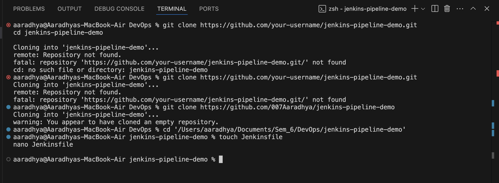

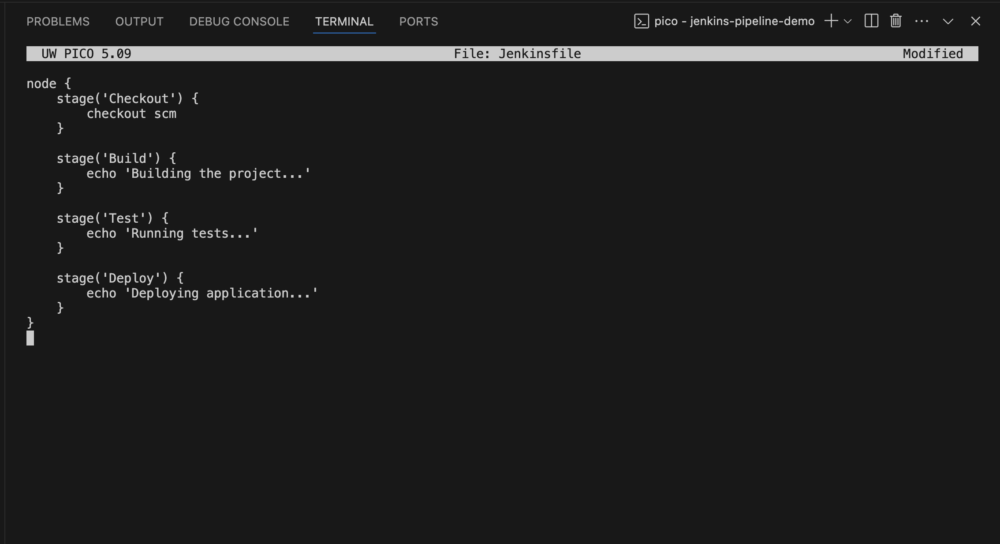

---

## **Step 2: Push Jenkinsfile to GitHub**
Run these commands:
```bash
git add Jenkinsfile
git commit -m "Added Jenkinsfile"
git push origin main
```

Now, your `Jenkinsfile` is in the GitHub repository.

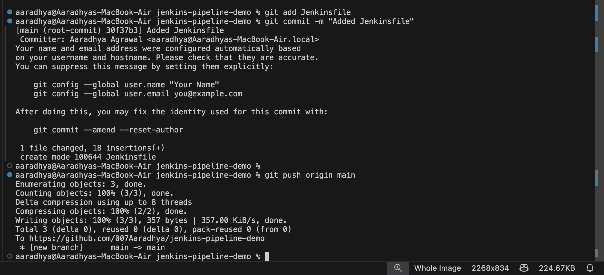

---

## **Step 3: Configure GitHub Credentials in Jenkins**
### If Using SSH:
1. **Generate an SSH Key** (if not already generated):
   ```bash
   ssh-keygen -t rsa -b 4096 -C "your-email@example.com"
   ```
   Press Enter for default options.

   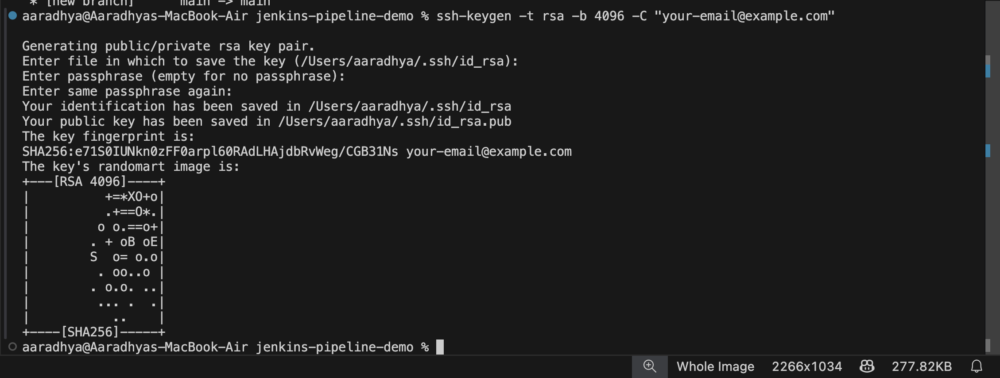
   
3. **Copy the public key**:
   ```bash
   cat ~/.ssh/id_rsa.pub
   ```
   Copy and **add this key to GitHub** → `Settings` → `SSH and GPG keys` → `New SSH Key`.
   
    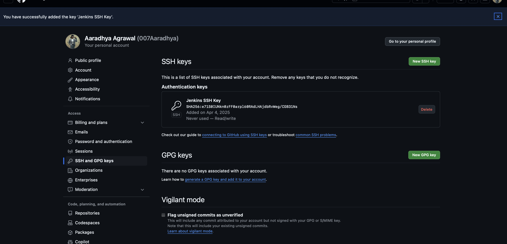
   
    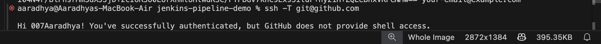
   
5. **Add SSH Credentials to Jenkins**:
   - Go to Jenkins → `Manage Jenkins` → `Manage Credentials`.
   - Select `Global credentials`.
   - Click `Add Credentials`.
   - Choose **SSH Username with Private Key**.
   - Enter:
     - **ID**: `github-ssh`
     - **Private Key**: Copy from `~/.ssh/id_rsa`
   - Save.
  
    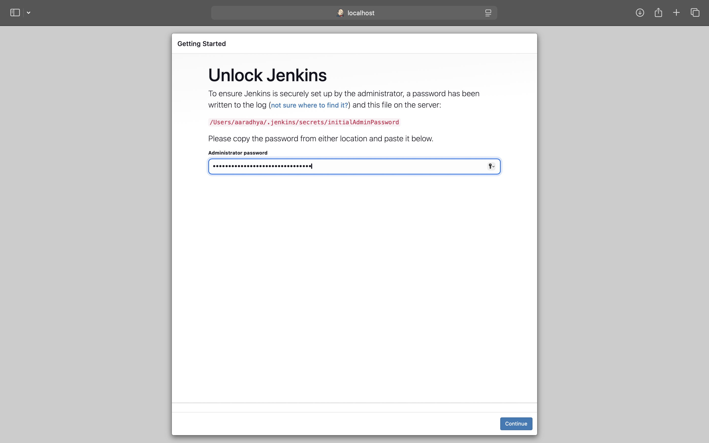
   
    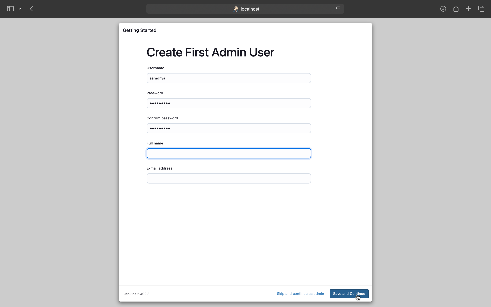

    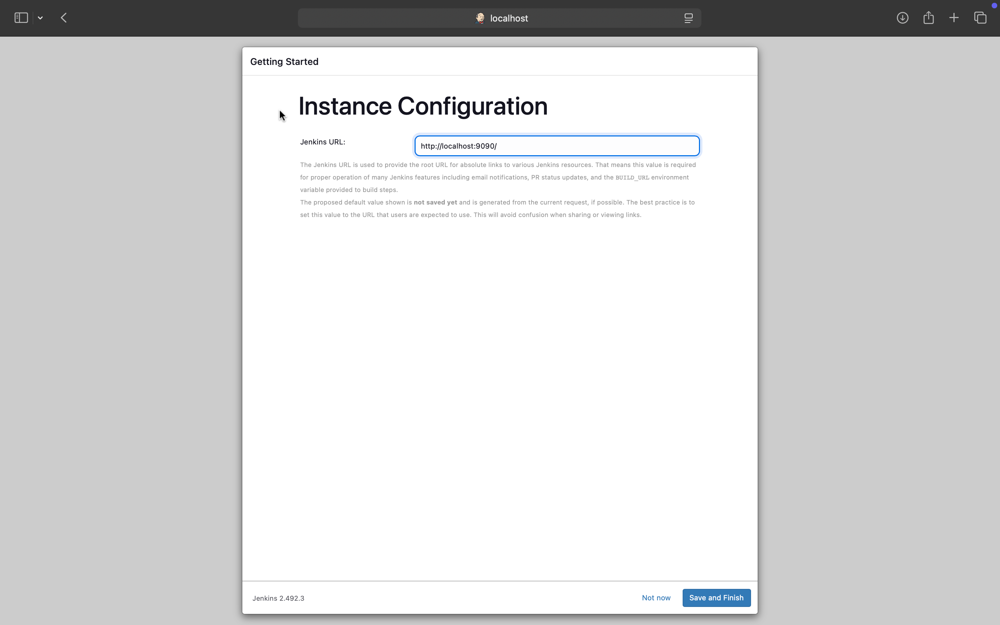
   
---

## **Step 4: Configure Jenkins Pipeline Job**
1. Go to **Jenkins Dashboard** → `New Item`.
2. Enter **Job Name** (e.g., `jenkins-pipeline-demo`).
3. Select **Pipeline** and Click `OK`.
4. Scroll down to **Pipeline Definition**:
   - Select **Pipeline script from SCM**.
   - Choose **Git**.
   - Enter your **GitHub Repository URL** (Use SSH or HTTPS based on credentials).
   - Choose credentials (`github-ssh` or GitHub token).
   - Set **Branch** to `main`.
5. Click **Save**.

    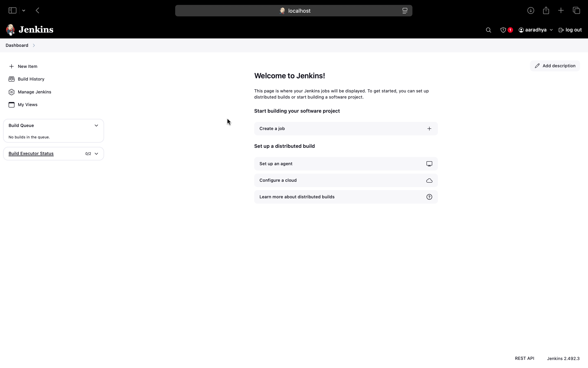
   
    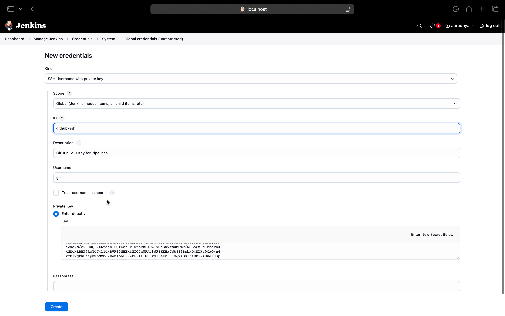

    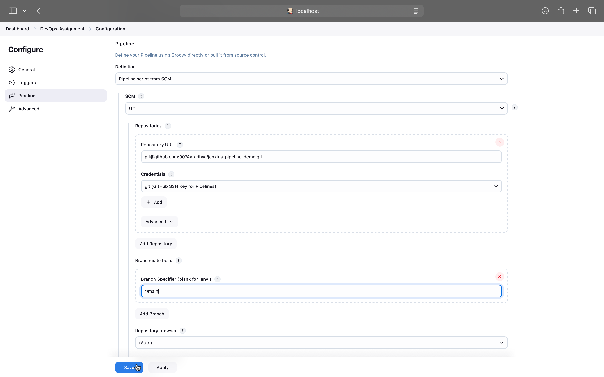
   
---

## **Step 5: Run the Pipeline**
1. Open the pipeline job.
2. Click **Build Now**.
3. Go to **Console Output** to see if it runs successfully.

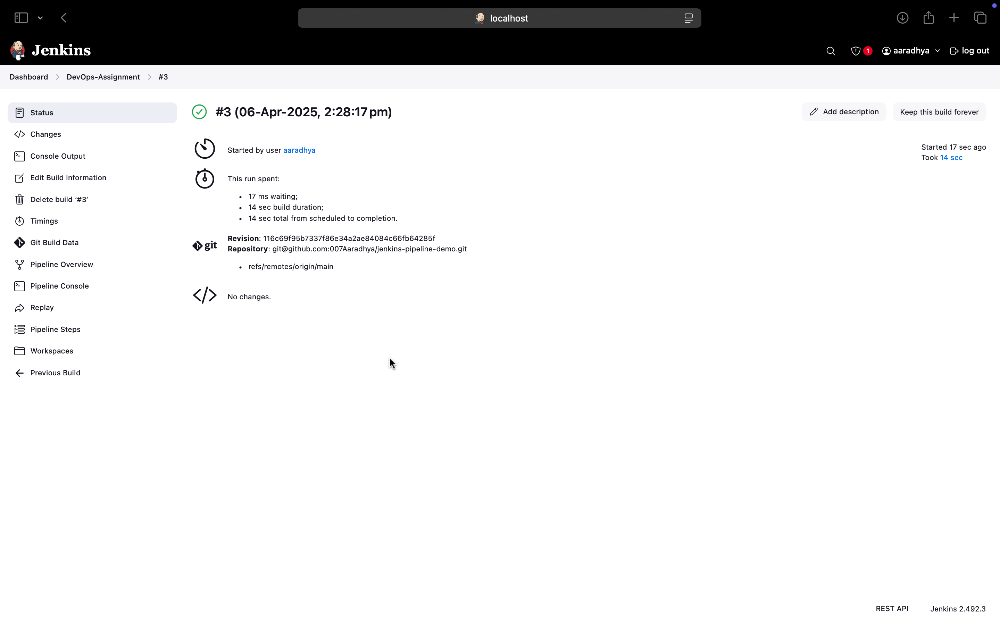

---
